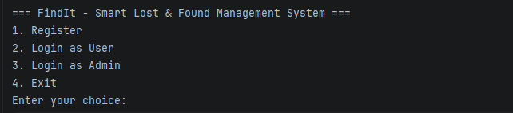
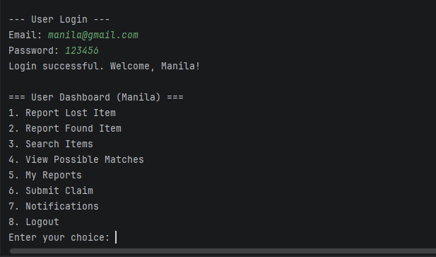
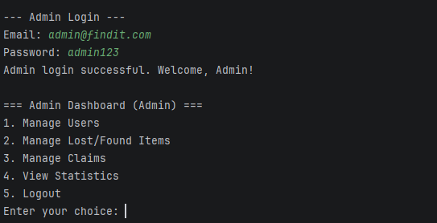

# FindIt - Smart Lost & Found Management System

FindIt is a Java-based terminal application designed to manage lost and found items efficiently. The system allows users to report lost or found items, search for items, view possible matches, submit claims, and receive notifications, while administrators can manage users, items, claims, and system statistics.

## Features Implemented

### User Features
- User registration
- User login and authentication
- Report lost items
- Report found items
- Search lost and found items
- Search items using keywords
- Filter searches by category
- View possible matches for lost items
- Automatic match scoring based on:
    - Category
    - Item name
    - Color
    - Location
    - Date
    - Description
- View personal lost and found reports
- Submit claims for found items
- View notifications
- Mark notifications as read
- Logout functionality

### Admin Features
- Admin login
- View all registered users
- View all lost items
- View all found items
- View and manage claims
- Approve claims
- Reject claims
- Automatically update item status after claim approval
- Send notifications to users after claim decisions
- View system statistics
- Logout functionality

### Additional Features
- Input validation for empty fields
- Integer input validation
- Date format validation
- Custom `ClaimNotFoundException`
- JDBC database connectivity
- DAO-based database operations
- Service-layer architecture
- Prepared statements for database queries
- Object-oriented programming concepts including inheritance, abstraction, encapsulation, method overloading, and polymorphism

---

## Technologies and Libraries Used

| Technology | Version / Details |
|---|---|
| Programming Language | Java |
| Java Version | Java 25 |
| Build Tool | Apache Maven |
| Database | MySQL |
| Database Connectivity | JDBC |
| JDBC Driver | MySQL Connector/J 8.0.33 |
| Application Type | Console / Terminal Application |
| IDE | IntelliJ IDEA |

### Maven Dependency

The project uses the following MySQL JDBC driver:

```xml
<dependency>
    <groupId>mysql</groupId>
    <artifactId>mysql-connector-java</artifactId>
    <version>8.0.33</version>
</dependency>
```

---

# Database Setup

The application uses a MySQL database named `findit_db`.

## 1. Create the Database

Open MySQL Workbench, MySQL Command Line Client, or another MySQL tool and run:

```sql
CREATE DATABASE findit_db;

USE findit_db;
```

## 2. Create the Required Tables

Run the following SQL script:

```sql
CREATE DATABASE IF NOT EXISTS findit_db;

USE findit_db;

-- Users Table
CREATE TABLE users (
    user_id INT PRIMARY KEY AUTO_INCREMENT,
    name VARCHAR(100) NOT NULL,
    email VARCHAR(150) NOT NULL UNIQUE,
    password VARCHAR(255) NOT NULL,
    phone VARCHAR(30) NOT NULL
);

-- Admins Table
CREATE TABLE admins (
    admin_id INT PRIMARY KEY AUTO_INCREMENT,
    name VARCHAR(100) NOT NULL,
    email VARCHAR(150) NOT NULL UNIQUE,
    password VARCHAR(255) NOT NULL
);

-- Lost Items Table
CREATE TABLE lost_items (
    item_id INT PRIMARY KEY AUTO_INCREMENT,
    user_id INT NOT NULL,
    category VARCHAR(100) NOT NULL,
    item_name VARCHAR(150) NOT NULL,
    color VARCHAR(50) NOT NULL,
    location VARCHAR(255) NOT NULL,
    item_date DATE NOT NULL,
    description TEXT NOT NULL,
    status VARCHAR(50) NOT NULL DEFAULT 'ACTIVE',

    FOREIGN KEY (user_id)
        REFERENCES users(user_id)
        ON DELETE CASCADE
);

-- Found Items Table
CREATE TABLE found_items (
    item_id INT PRIMARY KEY AUTO_INCREMENT,
    user_id INT NOT NULL,
    category VARCHAR(100) NOT NULL,
    item_name VARCHAR(150) NOT NULL,
    color VARCHAR(50) NOT NULL,
    location VARCHAR(255) NOT NULL,
    item_date DATE NOT NULL,
    description TEXT NOT NULL,
    status VARCHAR(50) NOT NULL DEFAULT 'ACTIVE',

    FOREIGN KEY (user_id)
        REFERENCES users(user_id)
        ON DELETE CASCADE
);

-- Claims Table
CREATE TABLE claims (
    claim_id INT PRIMARY KEY AUTO_INCREMENT,
    lost_item_id INT NOT NULL,
    found_item_id INT NOT NULL,
    claimant_id INT NOT NULL,
    match_score DOUBLE NOT NULL,
    status VARCHAR(50) NOT NULL DEFAULT 'PENDING',

    FOREIGN KEY (lost_item_id)
        REFERENCES lost_items(item_id)
        ON DELETE CASCADE,

    FOREIGN KEY (found_item_id)
        REFERENCES found_items(item_id)
        ON DELETE CASCADE,

    FOREIGN KEY (claimant_id)
        REFERENCES users(user_id)
        ON DELETE CASCADE
);

-- Notifications Table
CREATE TABLE notifications (
    notification_id INT PRIMARY KEY AUTO_INCREMENT,
    user_id INT NOT NULL,
    message TEXT NOT NULL,
    is_read BOOLEAN NOT NULL DEFAULT FALSE,
    created_at TIMESTAMP DEFAULT CURRENT_TIMESTAMP,

    FOREIGN KEY (user_id)
        REFERENCES users(user_id)
        ON DELETE CASCADE
);
```

## 3. Insert an Admin Account

The application requires an admin account to test the Admin Login functionality.

Run:

```sql
INSERT INTO admins (name, email, password)
VALUES ('System Admin', 'admin@findit.com', 'admin123');
```

You can then log in using:

```text
Email: admin@findit.com
Password: admin123
```

> Note: The current application stores passwords directly in the database for this academic project. Password hashing has not been implemented.

---

# Database Configuration

The project contains a `config.properties` file in the project root.

The current configuration is:

```properties
db.url=jdbc:mysql://localhost:3306/findit_db
db.user=root
db.password=root
```

Change the `db.user` and `db.password` values if your local MySQL username or password is different.

For example:

```properties
db.url=jdbc:mysql://localhost:3306/findit_db
db.user=root
db.password=YOUR_MYSQL_PASSWORD
```

Make sure that:

1. MySQL Server is installed.
2. MySQL Server is running.
3. The `findit_db` database exists.
4. All required tables have been created.
5. The credentials in `config.properties` are correct.

---

# Project Structure

```text
Findit/
│
├── pom.xml
├── config.properties
│
└── src/
    └── main/
        └── java/
            └── org/
                └── example/
                    └── Findit/
                        │
                        ├── Main.java
                        ├── DB_Connection.java
                        │
                        ├── Model/
                        │   ├── Admin.java
                        │   ├── Claim.java
                        │   ├── Founditem.java
                        │   ├── Item.java
                        │   ├── Lostitem.java
                        │   ├── Matchresult.java
                        │   ├── Notification.java
                        │   └── User.java
                        │
                        ├── dao/
                        │   ├── ClaimDAOImpl.java
                        │   ├── ItemDAOImpl.java
                        │   └── UserDAOImpl.java
                        │
                        ├── service/
                        │   ├── Adminservice.java
                        │   ├── Authservice.java
                        │   ├── Claimservice.java
                        │   ├── Itemservice.java
                        │   ├── Matchingservice.java
                        │   └── Notificationservice.java
                        │
                        ├── exception/
                        │   └── ClaimNotFoundException.java
                        │
                        └── util/
                            ├── Dateutil.java
                            └── Inputvalidator.java
```

---

# Setup and Run Instructions

## Prerequisites

Make sure the following are installed:

- Java JDK 25
- Apache Maven
- MySQL Server
- MySQL Workbench (optional)
- IntelliJ IDEA or another Java IDE

You can verify Java and Maven installation using:

```bash
java -version
```

and:

```bash
mvn -version
```

---

## Step 1: Clone or Open the Project

Open the `Findit` project in IntelliJ IDEA.

Make sure the project root contains:

```text
pom.xml
config.properties
src/
```

---

## Step 2: Configure MySQL

Start your MySQL server and create the database:

```sql
CREATE DATABASE findit_db;
```

Then execute the table creation SQL provided in the **Database Setup** section.

---

## Step 3: Configure Database Credentials

Open:

```text
config.properties
```

Update the values according to your MySQL configuration:

```properties
db.url=jdbc:mysql://localhost:3306/findit_db
db.user=root
db.password=root
```

---

## Step 4: Build the Project Using Maven

Open a terminal in the project root and run:

```bash
mvn clean compile
```

Maven will download the required MySQL JDBC dependency and compile the Java source files.

---

## Step 5: Run the Application

The main class is:

```text
org.example.Findit.Main
```

If running through IntelliJ IDEA:

1. Open `Main.java`.
2. Right-click inside the file.
3. Select **Run 'Main.main()'**.

The application will display:

```text
=== FindIt - Smart Lost & Found Management System ===
1. Register
2. Login as User
3. Login as Admin
4. Exit
```

---

## Running from Maven

The project can be compiled using:

```bash
mvn clean compile
```

The compiled application can then be run from the IDE using the `Main` class.

---

# Application Usage

## User Workflow

A normal user can:

```text
Register
   ↓
Login as User
   ↓
User Dashboard
   ├── Report Lost Item
   ├── Report Found Item
   ├── Search Items
   ├── View Possible Matches
   ├── My Reports
   ├── Submit Claim
   ├── Notifications
   └── Logout
```

## Admin Workflow

An administrator can:

```text
Login as Admin
   ↓
Admin Dashboard
   ├── Manage Users
   ├── Manage Lost/Found Items
   ├── Manage Claims
   ├── View Statistics
   └── Logout
```

---

# Matching System

FindIt includes a rule-based matching system that calculates a percentage score between a lost item and found item.

The matching weights are:

| Attribute | Weight |
|---|---:|
| Category | 20% |
| Item Name | 25% |
| Color | 15% |
| Location | 15% |
| Date | 10% |
| Description | 15% |
| **Total** | **100%** |

The system classifies matches as:

```text
90% - 100%  → Very Strong Match
75% - 89%   → Strong Match
50% - 74%   → Possible Match
Below 50%   → Weak Match
```

The results are sorted from the highest match score to the lowest match score.

---

# Screenshots

Add 2–3 screenshots of the terminal application here after running the program.

### Screenshot 1 - Main Menu




### Screenshot 2 - User Dashboard




### Screenshot 3 - Admin Dashboard 




# Known Limitations

- The application is currently a terminal-based application and does not have a graphical user interface.
- Passwords are stored as plain text and password hashing has not been implemented.
- The matching system is rule-based and uses predefined attribute weights rather than machine learning or AI.
- The application does not support image uploading for lost or found items.
- Email or SMS notifications are not implemented; notifications are stored and displayed inside the application.
- Database credentials are stored in a local `config.properties` file.
- The application does not include an online/cloud-hosted database.
- No mobile application or web interface has been implemented.
- The system depends on a locally running MySQL server.

---

# Conclusion

FindIt provides a complete console-based solution for managing lost and found items using Java, JDBC, and MySQL. The system demonstrates database connectivity, object-oriented programming, DAO and service-layer architecture, user and admin authentication, item management, automated matching, claim processing, notifications, and input validation.